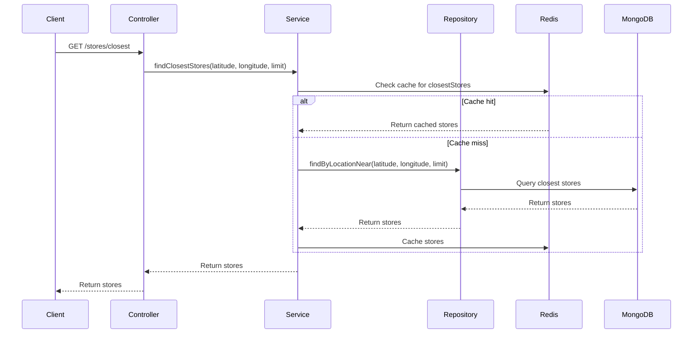

# Jumbo Store Locator API

## Overview

The Jumbo Store Locator API is a web service that allows users to find the closest Jumbo stores based on geographic coordinates. The service also supports adding and updating store information. The API is built with a Hexagonal Architecture to ensure maintainability and scalability, using modern technologies such as Java 21, Spring Boot, Redis, and MongoDB.

## Technologies Used

- **Java 21**
- **Spring Boot**
- **Maven**
- **Docker**
- **Redis**
- **MongoDB**
- **Testcontainers**
- **Rest-Assured**
- **Hexagonal Architecture**

## Key Features

- **Find Closest Stores**: Retrieve a list of the closest Jumbo stores based on provided latitude and longitude.
- **Find Closest Stores That Are Open**: Retrieve a list of the closest open Jumbo stores based on provided latitude and longitude.
- **Add Store**: Add a new store to the database.
- **Update Store**: Update an existing store by UUID.

## Architectural Decisions and Trade-offs

1. **Hexagonal Architecture**: This architecture style was chosen for its ability to separate business logic from external concerns (such as databases, messaging systems, and other APIs). This separation improves maintainability and testability.
2. **Redis for Caching**: Redis was used to cache results of frequent queries, enhancing performance and reducing load on the MongoDB database. The trade-off is the added complexity of managing cache consistency.
3. **MongoDB for Storage**: MongoDB’s geospatial query capabilities make it a suitable choice for storing and querying location-based data.
4. **Testcontainers for Integration Testing**: Testcontainers allow for reliable and consistent integration tests by using lightweight, disposable containers. This choice ensures tests are environment-agnostic and can run anywhere.
5. **Lack of Authentication/Authorization**: Due to time constraints, authentication and authorization were not implemented. For a comprehensive solution, refer to my project with Auth and Authorization [here](https://github.com/neewrobert/shopping-service).

## How to Run Locally

### Prerequisites

- Docker
- Java 21
- Maven

### Steps

1. **Clone the repository**:
    ```sh
    git clone https://github.com/yourusername/jumbo-store-locator.git
    cd jumbo-store-locator
    ```

2. **Build the project**:
    ```sh
    mvn clean install
    ```

3. **Use Makefile for Docker operations**:
   The Makefile simplifies the process of building, starting, stopping, and viewing logs of the Docker containers.

    - **Build Docker image**:
        ```sh
        make build
        ```

    - **Start the application using Docker Compose**:
        ```sh
        make up
        ```

    - **Stop the application and remove Docker Compose resources**:
        ```sh
        make down
        ```

    - **View logs**:
        ```sh
        make logs
        ```

    - **Full redeployment cycle**:
        ```sh
        make redeploy
        ```

### Access the API

- **Find the closest stores**:
    ```sh
    curl --location 'localhost:8080/stores/closest?longitude=4.615551&latitude=51.778461&limit=5'
    ```
- **Find the closest stores that are open**:
    ```sh
    curl --location 'localhost:8080/stores/closest/open?longitude=4.615551&latitude=51.778461&limit=5'
    ```
- **Add a new store**:
    ```sh
    curl --location --request POST 'localhost:8080/stores' \
    --header 'Content-Type: application/json' \
    --data '{
            "city": "New City",
            "postalCode": "12345",
            "street": "New Street",
            "street2": "1",
            "street3": "",
            "addressName": "New Store",
            "longitude": 4.0,
            "latitude": 52.0,
            "complexNumber": "00000",
            "showWarningMessage": false,
            "todayOpen": "08:00",
            "locationType": "Supermarkt",
            "collectionPoint": false,
            "sapStoreID": "0000",
            "todayClose": "20:00"
    }'
    ```
- **Update an existing store**:
    ```sh
    curl --location --request PUT 'localhost:8080/stores/A.oKYx4X5CEAAAFIaM8YwKxJ' \
    --header 'Content-Type: application/json' \
    --data '{
            "uuid": "A.oKYx4X5CEAAAFIaM8YwKxJ",
            "city": "Eygelshoven",
            "postalCode": "6471 EX",
            "street": "Portbeemden",
            "street2": "1",
            "street3": "",
            "addressName": "Jumbo Eygelshoven Portbeemden UPDATED",
            "longitude": 6.060411,
            "latitude": 50.894142,
            "complexNumber": "33089",
            "showWarningMessage": true,
            "todayOpen": "08:00",
            "locationType": "Supermarkt",
            "collectionPoint": false,
            "sapStoreID": "3113",
            "todayClose": "21:00"
    }'
    ```

### Access Grafana Dashboard

1. **Open Grafana**:
    Navigate to `http://localhost:3000` in your browser.

2. **Login to Grafana**:
    Default credentials are usually `admin/admin`.

3. **Import Dashboard**:
    - The Grafana dashboard was already created and it can be viewed on the tab DASHBOARDS > Jumbo Store Locator.

4. **View Metrics**:
    - Check the dashboard for various metrics like request latency, request count, error rates, and system load.

## Sequence Diagram



## Application Design

```plaintext
    +-----------------------+
    |    Store Controller   |
    +-----------------------+
               |
               V
    +-----------------------+
    |     Store Service     |
    +-----------------------+
               |
               V
    +-----------------------+
    |   Store Repository    |
    +-----------------------+
       |            |
       V            V
+-----------+   +----------+
|   Redis   |   |  MongoDB |
+-----------+   +----------+
```

## Notes

- **Authentication and Authorization**: It's recommended to implement authentication and authorization for better security. You can refer to my project [here](https://github.com/neewrobert/shopping-service) for an example implementation.
- **Makefile**: The Makefile provides an easy and efficient way to manage Docker operations, simplifying the development and deployment processes.
- The caching strategy could be further optimized based on specific use cases and access patterns.
- The current implementation focuses on demonstrating the functionality and structure of the service. More comprehensive error handling and validation can be added to enhance robustness.